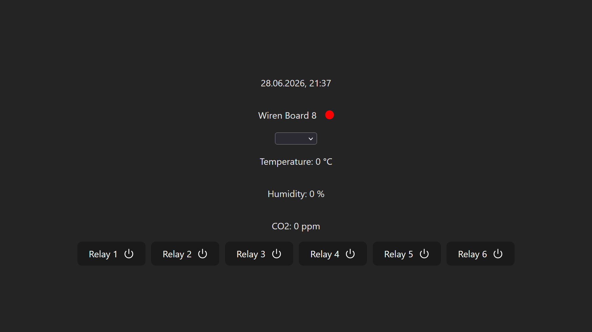

# MQTT Vue HMI Dashboard

A lightweight Vue 3 + TypeScript dashboard for monitoring and controlling IoT devices via MQTT.
Designed for integration with [Wiren Board](https://wirenboard.com/en/) controllers and rule engine [wb-rules](https://github.com/wirenboard/wb-rules).

## Screenshots

  

## What it does

- Show sensor data (temperature, humidity, CO2)
- Allow switching system working modes (Auto / Dosage / Check)
- Controls relays via MQTT
- Displays basic system status

## Dependencies

- Vue 3
- TypeScript
- Vite
- MQTT

## Notes

This is a lightweight prototype / template for MQTT-based control interfaces.
